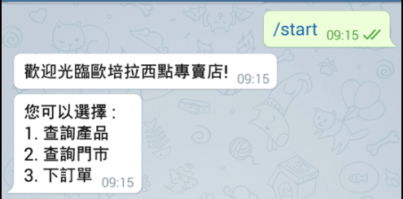

# TOC Project 2017

Template Code for TOC Project 2017

A telegram bot based on a finite state machine,
which provide service of searching the products of Opera,a bakery in Tainan,
also the book service of this store. 

## Setup

### Prerequisite
* Python 3

#### Install Dependency
```sh
pip install -r requirements.txt
```

* pygraphviz (For visualizing Finite State Machine)
    * [Setup pygraphviz on Ubuntu](http://www.jianshu.com/p/a3da7ecc5303)

### Secret Data

`API_TOKEN` and `WEBHOOK_URL` in app.py **MUST** be set to proper values.
Otherwise, you might not be able to run your code.

### Run Locally
You can either setup https server or using `ngrok` as a proxy.

**`ngrok` would be used in the following instruction**

```sh
ngrok http 5000
```

After that, `ngrok` would generate a https URL.

You should set `WEBHOOK_URL` (in app.py) to `your-https-URL/hook`.

#### Run the sever

```sh
python3 app.py
```

## Finite State Machine


## Usage
The initial state is set to `user`.

* user
	* Input: "/start"
	* Reply:
		
	* Go to state0
* state0
	* 1.
		* Input: string contains "查詢" or "1"
		* Reply: the product list of Oprea
		* Go to state1
	* 2.
		* Input: string contains "門市" or "2"
		* Reply: the store list and information of Oprea
		* Go to state2
	* 3.
		* Input: string contains "訂單" or "3"
		* Reply: the booking service of Oprea 
		* Go to state3
* state1
	* when user type the string contains "查詢" or "1" from state0
	* Reply:
		
	* input: the number or the name of type which user may interest in
	* reply: the product list of that type 
* state1_2
	* when user type the string contains "生日蛋糕" or "1" from state1
	* Reply:
		
	* input: the number or the name of product which user may interest in
	* reply: the detail information and the picture of that product
	* Go to state 1_2_3
* state1_2_3
	* Reply: the product information that user type from state1_2
		
	* Back to state 1_2 so that user can search other product

* state1_3
	* when user type the string contains "布丁" or "餅乾" or "2" from state1
	* Reply:
		
	* input: the number or the name of product which user may interest in
	* reply: the detail information and the picture of that product
	* Go to state 1_3_3
* state1_3_3
	* Reply: the product information that user type from state1_3
		
	* Back to state 1_3 so that user can search other product
* state1_4
	* when user type the string contains "菓子" or "3" from state1
	* Reply:
		
	* input: the number or the name of product which user may interest in
	* reply: the detail information and the picture of that product
	* Go to state 1_4_3
* state1_4_3
	* Reply: the product information that user type from state1_4
		
	* Back to state 1_4 so that user can search other product
* state2
	* when user type the string contains "門市" or "2" from state0
	* Reply: the store information and a link to further info about Opera
		
		
		
	* input: type 'n' can back to state0 
	* back to state0 
* state3
	* when user type the string contains "訂單" or "3" from state0
	* Reply: the product list of Opera
		
		
	* input: the name and the amount of the products which user want to book
			 type 'done' when user end booking
			
	* go to state3_2
* state3_2
	* when user type 'done' from state3
	* Reply: asking the client information 
		
	* go to state3_2_3
* state3_2_3
	* Reply: check the client information 
		
	* input: 'y' 
	* Reply: "訂購成功" , back to state0
			 the order will be uploaded to the google sheet , so the store can see all orders clearly
			 

	* input: 'n' 
	* Reply: back to state3 , rebook the order

## Author
[Lee-W](https://github.com/Lee-W) [Doris Tsao](https://github.com/YuRongTsao)
